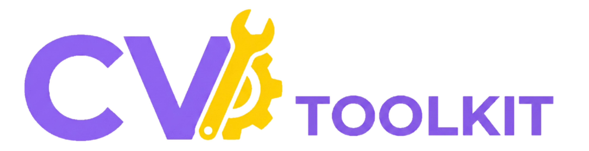

# CV Toolkit

<div align="center">
  
  
  **A Comprehensive Network Diagnostics & Utility Toolkit for Android**
  
  [](https://www.android.com/)
  [](https://android-arsenal.com/api?level=24)
  [](https://kotlinlang.org)
  [](https://developer.android.com/jetpack/compose)
  
  ---
  
  **⚠️ IMPORTANT:** If you use this repository, you **MUST** keep all author attribution intact.  
  **DO NOT REMOVE** the author credits. See [License & Attribution](#-license--attribution) for details.
  
  **Copyright © 2024 [Khoo Lay Yang](https://www.dkly.net) - All Rights Reserved**
</div>

---

## 📱 About

**CV Toolkit** is a professional-grade, all-in-one Android application designed for network diagnostics, cloud infrastructure monitoring, system information, and a comprehensive suite of developer utilities. Built with modern Android technologies (Kotlin + Jetpack Compose), it delivers 40+ powerful tools in one beautifully designed app.

**Perfect for:**
- 👨‍💻 **Network Administrators** - Comprehensive network diagnostics and monitoring
- 🌐 **Cloud Engineers** - Test connectivity to 311+ regions across 14 cloud providers with real-time graphs
- 🔐 **Security Professionals** - Port scanning, SSL checking, and security analysis tools
- 💻 **Software Developers** - Encoding, hashing, JWT decoding, and development utilities
- 🎓 **Students & Educators** - Learn networking concepts with hands-on tools
- 🏠 **Home Users** - Troubleshoot network issues and monitor your connection

**Why CV Toolkit?**
- ✅ All processing is done **100% locally** on your device
- ✅ Your data **never leaves your phone** - complete privacy guaranteed
- ✅ No registration or account required
- ✅ Works offline for most tools (network tools require connectivity)
- ✅ Professional-grade accuracy and performance
- ✅ Beautiful, modern Material Design 3 interface
- ✅ Regular updates with new features and improvements

---

## 🌟 Feature Highlights

### 🚀 **Advanced CDN & Cloud Latency Testing**
The crown jewel of CV Toolkit - a professional-grade network monitoring tool featuring:
- **Real-time line graphs** with multi-region visualization
- **Continuous monitoring** with configurable intervals (1s/2s/5s)
- **Comprehensive statistics**: Min, Max, Avg, Jitter, and Packet Loss tracking
- **311+ test regions** across 14 global cloud providers
- **Monitor 35+ regions simultaneously** with color-coded tracking
- **Edge location detection** for Cloudflare, CloudFront, and Alibaba Cloud
- **Background service** support for uninterrupted monitoring

### 📱 **40+ Professional Tools**
Everything you need for network diagnostics, development, and system analysis in one app.

### 🔒 **Privacy-First Design**
- Zero data collection
- No server uploads
- 100% local processing
- Open and transparent

---

## ✨ Key Features

### 🌐 Network Tools (13 Tools)

- **Speed Test** - Comprehensive internet speed testing with download/upload speeds, ping latency, jitter measurement, and historical tracking. Foreground service support for uninterrupted testing
- **Ping Test** - ICMP ping testing with packet count configuration, timeout settings, and detailed statistics (min/max/avg/packet loss)
- **Traceroute** - Visual network path tracing showing all hops with latency measurements and geographic information
- **Port Scanner** - Scan for open ports on any host
- **Network Scanner (Device Discovery)** - Discover all devices connected to your network
- **IP Lookup** - Get detailed geolocation and ISP information for any IP address
- **DNS Lookup** - Comprehensive DNS record querying (A, AAAA, CNAME, MX, TXT, NS, SOA, PTR) with custom DNS server support and response time tracking
- **Subnet Calculator** - Advanced IPv4/IPv6 subnet calculations with CIDR notation, network/broadcast addresses, usable host range, and subnet mask conversion
- **SSL/TLS Checker** - Detailed SSL certificate inspection including validity period, issuer information, subject details, certificate chain, encryption algorithms, and expiration warnings
- **Whois Lookup** - Get domain registration information
- **HTTP Headers Viewer** - Inspect HTTP response headers
- **Custom Request Builder** - Build and send custom HTTP/CURL requests with headers
- **CDN & Cloud Latency Test** - **Real-time monitoring with live graphs** - Test latency to 311+ regions across 14 major providers with continuous ping, multi-region tracking, detailed statistics (min/max/avg/jitter/packet loss), automatic edge detection, and color-coded line charts:
  - AWS (Amazon Web Services)
  - GCP (Google Cloud Platform)
  - Azure (Microsoft Azure)
  - Oracle Cloud
  - Alibaba Cloud
  - DigitalOcean
  - Linode (Akamai)
  - Vultr
  - Hetzner
  - OVH
  - Tencent Cloud
  - Huawei Cloud
  - Lightsail
  - Fastly

### 🛠️ Utility Tools (23 Tools)

**Encoders & Decoders:**
- **Base64 Encoder/Decoder** - Encode and decode Base64 strings
- **URL Encoder/Decoder** - Encode and decode URL strings
- **Binary Converter** - Convert text to/from Binary, Hex, and Octal
- **Hex Encoder/Decoder** - Convert text to/from hexadecimal
- **ASCII Converter** - Convert text to ASCII values and vice versa
- **JWT Decoder** - Decode and inspect JWT tokens

**Security & Cryptography:**
- **Hash Generator** - Generate MD5, SHA-1, SHA-256, SHA-512 hashes
- **Caesar Cipher** - Encrypt/decrypt with Caesar cipher, ROT13, ROT47
- **Morse Code Converter** - Convert text to Morse code and back
- **Password Generator** - Generate strong, secure passwords
- **File Hash Calculator** - Calculate MD5, SHA, CRC32 hashes for files with metadata

**QR Codes & Barcodes:**
- **QR Code Generator** - Generate QR codes from text, URLs, contacts, etc.
- **Barcode Generator** - Generate various barcode formats (EAN, UPC, Code 128, etc.)
- **QR/Barcode Scanner** - Scan and decode QR codes and barcodes with camera

**Text & Data Tools:**
- **Text Counter** - Count words, characters, lines, and paragraphs
- **Text Diff** - Compare two texts and highlight differences
- **IP Calculator** - Convert between different IP formats
- **Color Converter** - Convert between HEX, RGB, HSL, and CMYK color formats

**Time & ID Tools:**
- **World Time** - View current time across global time zones
- **Unix Timestamp Converter** - Convert between Unix timestamps and readable dates
- **UUID Generator** - Generate UUID v1, v4, and v5

**Measurement:**
- **Unit Converter** - Convert length, weight, temperature, and data sizes

**Utility:**
- **Stopwatch** - Timer with lap functionality
- **User Agent Parser** - Parse and analyze browser User-Agent strings

### 📱 Device Tools (3 Tools)

- **Device Information** - Complete system information (CPU, RAM, storage, OS, etc.)
- **DRM & Codec Info** - View DRM systems, video/audio codecs, and supported formats
- **Camera Information** - Detailed camera specifications and capabilities

---

## 🏗️ Technical Stack

- **Language:** Kotlin (100%)
- **UI Framework:** Jetpack Compose (Modern declarative UI with Material Design 3)
- **Architecture:** MVVM with Repository pattern for clean separation of concerns
- **Networking:** 
  - Retrofit 2 (Type-safe REST API calls)
  - OkHttp (HTTP client with interceptor support)
  - Gson (JSON parsing and serialization)
  - Coroutines (Asynchronous programming)
- **Camera & ML:**
  - CameraX (Modern camera API with preview)
  - ML Kit Barcode Scanning (On-device QR/Barcode recognition)
  - ZXing (QR code and barcode generation)
- **Data Visualization:**
  - Canvas API (Custom line graphs and charts)
  - Real-time rendering with Compose recomposition
- **Background Processing:**
  - Foreground Services (Speed tests and continuous monitoring)
  - Coroutines (Parallel processing and async operations)
- **Navigation:** Jetpack Navigation Compose with type-safe routes
- **Minimum SDK:** Android 7.0 (API 24) - Wide device compatibility
- **Target SDK:** Android 14 (API 36) - Latest Android features
- **Image Loading:** Coil (Efficient image loading with caching)
- **Monetization:** Google AdMob (Non-intrusive banner ads)

## 🎨 UI/UX Features

- **Material Design 3** - Modern, beautiful interface following Google's latest design guidelines
- **Dynamic Theming** - Adapts to system theme (Light/Dark mode)
- **Responsive Layout** - Optimized for all screen sizes and orientations
- **Smooth Animations** - Polished transitions and interactions
- **Color-Coded Indicators** - Visual feedback for latency quality and status
- **Real-time Updates** - Live data visualization without page refreshes
- **Provider Logos** - Visual identification with official brand logos
- **Intuitive Navigation** - Easy-to-use interface with logical organization
- **Copy & Share** - One-tap actions for results and data
- **Search & Filter** - Quickly find what you need across 311+ regions

---

## 🆕 What's New - Latest Updates

### Real-time CDN Monitoring Revolution 🚀
The CDN & Cloud Latency Test has been completely redesigned with professional-grade features:

**🎯 Real-time Line Graphs**
- Multi-color line charts showing latency trends over time
- Support for monitoring 35+ regions simultaneously
- Auto-scaling Y-axis with grid lines
- Time-series X-axis with mm:ss timestamps
- Smooth animations and responsive updates

**📊 Continuous Monitoring**
- Configurable ping intervals (1s, 2s, or 5s)
- Background service support for uninterrupted testing
- Add/remove regions on-the-fly without stopping monitoring
- Batch monitoring for all regions in a provider

**📈 Advanced Statistics**
- **Per-region statistics cards** with color-coded latency badges:
  - 🟢 Green: < 50ms (Excellent)
  - 🟡 Yellow: 50-100ms (Good)
  - 🟠 Orange: 100-200ms (Fair)
  - 🔴 Red: ≥ 200ms (Poor)
- **Comprehensive metrics**: Sent count, Packet loss %, Min/Max/Avg latency, Jitter
- **Historical tracking**: Last 30 data points per region
- **Graph legend**: Color-coded region identification

**🌐 Edge Detection**
- Automatically detects your CDN edge location
- Shows Cloudflare, CloudFront, and Alibaba Cloud connections
- Visual provider logos for easy identification

**✨ UI Improvements**
- Provider logos for all 14 cloud providers
- Sort by latency, name, or location
- Search and filter across 311+ regions
- Export results for documentation
- Responsive Material Design 3 interface

---

## 📸 Screenshots

<!-- Add your screenshots here -->
```
[Screenshot 1: Main Screen]  [Screenshot 2: Network Tools]  [Screenshot 3: Utility Tools]
```

---

## 🚀 Getting Started

### Prerequisites

- **Android Studio:** Hedgehog (2023.1.1) or later recommended
- **Android SDK:** API 24 (Android 7.0) or higher
- **Kotlin:** 1.9+
- **Gradle:** 8.0+
- **JDK:** Java 11 or higher

### Installation

1. **Clone the repository:**

```bash
git clone https://github.com/osscv/CV-Toolkit.git
cd CVToolkit
```

2. **Open the project in Android Studio**
   - Select "Open an Existing Project"
   - Navigate to the cloned directory
   - Android Studio will automatically detect the project

3. **Sync Gradle dependencies**
   - Android Studio will prompt to sync
   - Or manually: File → Sync Project with Gradle Files

4. **Configure AdMob (Optional)**
   - The app includes AdMob integration
   - AdMob ID is in `AndroidManifest.xml`
   - Replace with your own ID if publishing your own version

5. **Build and run**
   - Connect your Android device or start an emulator
   - Click Run (▶) or press Shift+F10

### Build Commands

**Debug Build:**
```bash
./gradlew assembleDebug
```

**Release Build:**
```bash
./gradlew assembleRelease
```

**Install on Device:**
```bash
./gradlew installDebug
```

**Run Tests:**
```bash
./gradlew test
```

**APK Location:**
- Debug: `app/build/outputs/apk/debug/app-debug.apk`
- Release: `app/build/outputs/apk/release/app-release.apk`

---

## 📦 Features Breakdown

### IP Lookup with History
- Lookup your current IP or any custom IP address
- Get detailed information: location, ISP, ASN, timezone
- History tracking with timestamps stored locally
- Uses dkly DATAHUB API

### CDN & Cloud Latency Testing - **Advanced Real-time Monitoring**

**Comprehensive Provider Coverage:**
- **311+ Test Regions** across **14 Major Providers**:
  - Azure (46 regions)
  - AWS (30+ regions)  
  - Google Cloud Platform (40+ regions)
  - Alibaba Cloud (23 regions)
  - Oracle Cloud (20 regions)
  - DigitalOcean (15 regions)
  - Vultr (32 regions)
  - Linode (12 regions)
  - Lightsail (11 regions)
  - Hetzner (6 regions)
  - OVH (17 regions)
  - Fastly (18 regions)
  - Tencent Cloud (15 regions)
  - Huawei Cloud (12 regions)

**Edge Location Detection:**
- Automatically detects your nearest CDN edge location
- Shows Cloudflare, CloudFront, and Alibaba Cloud edge servers
- Displays real-time connection information

**Real-time Monitoring & Graphing:**
- **Live Line Graph** - Visualize latency trends over time with multi-color line charts
- **Continuous Ping Mode** - Monitor multiple regions simultaneously
- **Configurable Intervals** - Choose between 1s, 2s, or 5s ping intervals
- **Multi-region Tracking** - Monitor up to 35+ regions at once with color-coded lines
- **Auto-scaling Graph** - Dynamic Y-axis scaling based on latency values
- **Time-series Display** - X-axis shows timestamps with mm:ss format

**Detailed Statistics:**
- **Current Latency** - Real-time latency with color indicators (Green < 50ms, Yellow < 100ms, Orange < 200ms, Red ≥ 200ms)
- **Min/Max/Avg** - Comprehensive latency statistics
- **Jitter** - Network stability measurement (variance between consecutive pings)
- **Packet Loss** - Percentage of failed ping attempts
- **Sent Count** - Total number of ping attempts
- **Historical Data** - Stores last 30 data points per region

**Advanced Features:**
- **Provider Logos** - Visual provider identification with official logos
- **Sort Options** - Sort by latency, name, or location
- **Search & Filter** - Quickly find specific regions
- **Export Results** - Share and save test results
- **Add/Remove Monitoring** - Dynamically add or remove regions from monitoring
- **Background Service** - Continue testing even when app is minimized
- **Statistics Cards** - Individual stat cards for each monitored region with color-coded badges

### Network Scanner (Device Discovery)
- **Fast Network Scanning** - Discover all devices on your local network
- **MAC Address Lookup** - Identify device manufacturers automatically
- **Parallel Scanning** - Multi-threaded scanning for faster results
- **Device Details** - IP address, MAC address, hostname, and manufacturer
- **Export Functionality** - Save device list for documentation
- **Real-time Updates** - See devices as they're discovered

### Port Scanner
- **Comprehensive Port Scanning** - Scan any port range (1-65535)
- **Common Ports Preset** - Quick scan of well-known service ports
- **Service Detection** - Automatic identification of services (HTTP, FTP, SSH, etc.)
- **Parallel Scanning** - Multi-threaded for faster results
- **Timeout Configuration** - Adjustable connection timeouts
- **Export Results** - Save scan reports for security audits

### QR/Barcode Scanner
- **ML Kit Powered** - Google's machine learning for accurate scanning
- **Multiple Format Support** - QR Code, EAN-8, EAN-13, UPC-A, UPC-E, Code 39, Code 93, Code 128, ITF, Codabar, Aztec, Data Matrix, PDF417
- **Real-time Camera Preview** - Instant scanning with visual feedback
- **Automatic Detection** - No need to press buttons, auto-detects codes
- **Smart Actions** - Automatic URL opening, contact adding, Wi-Fi connecting
- **Scan History** - Keep track of all scanned codes with timestamps
- **Copy to Clipboard** - One-tap copy of scanned content
- **Flashlight Support** - Scan in low-light conditions

---

## 💡 Use Cases & Examples

### For Network Administrators
1. **Network Troubleshooting**
   - Use Ping Test to verify host connectivity
   - Run Traceroute to identify routing issues
   - Scan network with Device Discovery to find unauthorized devices
   - Check DNS resolution with DNS Lookup

2. **Infrastructure Monitoring**
   - Monitor cloud regions with CDN Latency Test's continuous mode
   - Track jitter and packet loss for quality assessment
   - Export results for reports and documentation

3. **Security Audits**
   - Scan ports to identify exposed services
   - Check SSL certificates for expiration and validity
   - Verify DNS records and configurations

### For Cloud Engineers
1. **Multi-region Latency Testing**
   - Test all AWS/Azure/GCP regions simultaneously
   - Compare provider performance from your location
   - Identify optimal regions for deployment

2. **Performance Monitoring**
   - Set up continuous monitoring for critical regions
   - Track latency trends over time with graphs
   - Analyze jitter and stability metrics

### For Developers
1. **API Development**
   - Test HTTP headers and responses
   - Build custom HTTP requests with headers
   - Decode JWT tokens for debugging
   - Generate test data (UUIDs, passwords, QR codes)

2. **Data Processing**
   - Encode/decode Base64 strings
   - Calculate hash values (MD5, SHA)
   - Convert between formats (hex, binary, ASCII)
   - Parse and analyze user agent strings

### For Students & Learning
- Visualize how network routing works (Traceroute)
- Understand DNS resolution process
- Learn about subnet calculations and IP addressing
- Explore different encoding formats
- See real-time network latency across the globe

---

## 🔒 Privacy & Security

**Your Privacy Matters:**
- ✅ All data processing is performed **locally on your device**
- ✅ **No data is uploaded** to our servers or any external servers
- ✅ Network scans, device information, and lookup results stay on your phone only
- ✅ IP lookup history is stored locally only
- ✅ No personal data collection, storage, or transmission
- ✅ Open source and transparent

**Permissions Used:**
- `INTERNET` - Required for network diagnostics, IP lookups, DNS queries
- `ACCESS_NETWORK_STATE` - Detect current network configuration
- `CAMERA` - QR/Barcode scanning (optional feature)
- `FOREGROUND_SERVICE` - Background speed tests
- `POST_NOTIFICATIONS` - Speed test progress notifications

**Advertising:**
- This app displays ads via Google AdMob
- Google may collect data for personalized advertising
- Refer to [Google's Privacy Policy](https://policies.google.com/privacy) for details

---

## ⚠️ Responsible Use

This app is designed for **legitimate network diagnostics, troubleshooting, and educational purposes only**.

**Please Note:**
- Only use network scanning tools on networks and devices you **own** or have **explicit permission** to test
- Unauthorized network scanning or port scanning may be **illegal** in your jurisdiction
- The app is provided "as is" without warranty
- The developer is not responsible for misuse or any legal issues arising from use of this app

---

## 🤝 Contributing

Contributions are welcome! Please feel free to submit a Pull Request.

### Contribution Guidelines

1. Fork the project
2. Create your feature branch (`git checkout -b feature/AmazingFeature`)
3. Commit your changes (`git commit -m 'Add some AmazingFeature'`)
4. Push to the branch (`git push origin feature/AmazingFeature`)
5. Open a Pull Request

### ⚠️ Important Note for Contributors

**By contributing to this project, you agree to:**
- Maintain all existing author attributions and copyright notices
- Not remove or modify credits to the original author (Khoo Lay Yang)
- Keep the "About Author" section intact in the application
- Preserve all copyright and attribution information in documentation

All contributions will be reviewed to ensure compliance with these requirements.

---

## 📝 License & Attribution

Copyright © 2024 Khoo Lay Yang. All Rights Reserved.

This project is proprietary software. Unauthorized copying, distribution, modification, or use of this software is prohibited without explicit permission from the author.

### ⚠️ Attribution Requirements

**IMPORTANT:** If you use, fork, or modify this repository, you **MUST**:

1. **Keep all author attribution intact** - Do not remove or modify:
   - The copyright notice "Copyright © 2024 Khoo Lay Yang"
   - Author information (Name: Khoo Lay Yang, Website: www.dkly.net)
   - "Made with ❤️ by Khoo Lay Yang" footer in the README
   - Author credits in the app's "About Author" section

2. **Maintain the original author credits** in any:
   - Documentation files (README, LICENSE, etc.)
   - Source code headers or comments
   - Application UI/About screens
   - Derivative works or forks

3. **Give appropriate credit** when:
   - Sharing or distributing the app
   - Creating derivative works
   - Using code snippets or substantial portions
   - Publishing modified versions

**Removal or modification of author attribution is strictly prohibited and constitutes a violation of the copyright.**

For commercial use, licensing inquiries, or permission requests, please contact: www.dkly.net

---

## 👨‍💻 Author

**Khoo Lay Yang**

- Website: [www.dkly.net](https://www.dkly.net)

---

## 📞 Support

Feel free to open an issue on GitHub for:
- 🐛 Bug reports
- 💡 Feature requests or suggestions
- ❓ Questions about functionality
- 🔧 Technical issues

---

## 🙏 Acknowledgments

- [Jetpack Compose](https://developer.android.com/jetpack/compose) - Modern Android UI toolkit
- [Retrofit](https://square.github.io/retrofit/) - Type-safe HTTP client
- [ZXing](https://github.com/zxing/zxing) - QR code generation
- [ML Kit](https://developers.google.com/ml-kit) - Barcode scanning
- [CameraX](https://developer.android.com/training/camerax) - Camera API
- [dkly DATAHUB](https://data.dkly.net) - IP lookup services
- All cloud providers for their global infrastructure

---

## 📊 Statistics

- **40+ Professional Tools** organized into 3 categories
- **311+ Global Test Regions** across 14 cloud/CDN providers
- **Real-time Monitoring** with live graphs and continuous ping
- **Advanced Analytics** - Min/Max/Avg/Jitter/Packet Loss tracking
- **100% Local Processing** - Your data stays on your device
- **Modern UI** with Material Design 3 and Jetpack Compose
- **Zero Server Dependencies** for core functionality
- **Multi-region Support** - Monitor 35+ regions simultaneously
- **Professional Grade** - Network diagnostics used by IT professionals
- **Privacy First** - No data collection, no tracking

---

<div align="center">
  
**Made with ❤️ by Khoo Lay Yang**

⭐ Star this repo if you find it useful!

</div>

